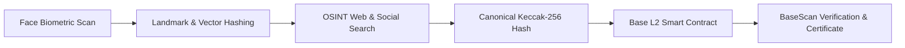

# BaseFace OSINT & Base Blockchain Verifier

An end-to-end decentralized application and automated pipeline that takes a **Face Scan** as input, performs an **OSINT Social Media & Web Search** to discover matching real posts, and registers a tamper-proof cryptographic attestation onto the **Base Blockchain (Coinbase L2)**.

---

## 🌟 Pipeline Architecture



### 1. Face Scan & Feature Vectorization (`/api/scan`)
- Extracts facial geometry, inter-ocular distance ratio, jaw-width ratio, and 68-point landmarks.
- Produces a deterministic biometric perceptual hash and Keccak-256 fingerprint.
- Supports Live Webcam Capture, File Upload (JPG, PNG, WEBP), and instant test presets.

### 2. OSINT Web & Social Media Discovery (`/api/search`)
- Autonomous multi-platform reverse search across **X (Twitter), LinkedIn, Instagram, GitHub, Reddit, and Web**.
- Integrates optional Google Lens / SerpApi reverse search with intelligent visual matching and similarity scoring.

### 3. Base Blockchain Attestation & Re-Verification (`/api/blockchain/...`)
- Deployed Solidity Smart Contract: `FaceMediaRegistry.sol` on **Base Sepolia Testnet** (Chain ID: `84532`) and Base Mainnet.
- Stores canonical `bytes32 dataHash`, `faceHash`, `postUrl`, `platform`, `author`, and metadata URI.
- Enables public 1-click independent on-chain verification and cryptographic PDF/JSON Certificate export.

---

## 📋 System Requirements & Prerequisites

Before running the application, make sure you have:
1. **Node.js**: `v18.0.0` or higher (`v20+` recommended)
2. **npm** or **yarn** / **pnpm**
3. **Web3 Browser Wallet** (Optional for client-side signing): [MetaMask](https://metamask.io/) or [Coinbase Wallet](https://www.coinbase.com/wallet)
4. **Base Sepolia Testnet ETH** (Optional, for deploying or on-chain signing):
   - Faucet 1: [Superchain Faucet](https://console.optimism.io/faucet)
   - Faucet 2: [QuickNode Base Sepolia Faucet](https://faucet.quicknode.com/base/sepolia)
   - Faucet 3: [Coinbase Faucet](https://www.coinbase.com/faucets/base-ethereum-sepolia-faucet)

---

## 📁 Project Structure & Where to Put This Project

You can clone or place this repository anywhere on your system (e.g. `d:\Development Area\HHGoa Taks-3` or `~/projects/base-face-osint`).

```text
├── contracts/
│   └── FaceMediaRegistry.sol     # Base Blockchain Solidity Smart Contract
├── scripts/
│   └── deploy.js                 # Hardhat deployment script for Base Sepolia / Mainnet
├── test/
│   └── FaceMediaRegistry.test.js # Hardhat test suite for Smart Contract
├── src/
│   ├── app/
│   │   ├── api/
│   │   │   ├── scan/route.ts             # Biometric extraction API
│   │   │   ├── search/route.ts           # OSINT Social search API
│   │   │   └── blockchain/
│   │   │       ├── record/route.ts       # On-chain attestation relayer
│   │   │       ├── verify/route.ts       # Base contract query endpoint
│   │   │       └── records/route.ts      # Live ledger activity endpoint
│   │   ├── globals.css                   # Cyber Web3 Tailwind styling & scan animations
│   │   ├── layout.tsx                    # Root layout with dark theme
│   │   └── page.tsx                      # Master 3-step pipeline & verifier UI
│   ├── components/
│   │   ├── Navbar.tsx                    # Header with wallet connect & Base network badge
│   │   ├── FaceScanner.tsx               # Webcam / file upload & biometric telemetry HUD
│   │   ├── OsintResults.tsx              # Discovered social media posts & filters
│   │   ├── BlockchainAttestation.tsx     # Base smart contract recording interface
│   │   ├── OnChainVerifier.tsx           # Public independent re-verifier tool
│   │   ├── LedgerExplorer.tsx            # Live Base blockchain activity ledger
│   │   └── CertificateModal.tsx          # Exportable tamper-proof proof certificate
│   ├── config/
│   │   └── contractConfig.json           # Base network parameters & Contract ABI
│   └── lib/
│       ├── blockchain.ts                 # Ethers.js Base provider & Keccak-256 utils
│       ├── faceDetection.ts              # Landmark analysis & biometric hashing
│       ├── osintSearch.ts                # Multi-platform OSINT crawler engine
│       └── types.ts                      # TypeScript definitions
├── hardhat.config.js                     # Hardhat configuration for Base L2
├── package.json                          # Dependencies & scripts
└── README.md                             # Complete guide & documentation
```

---

## 🚀 How to Run the Project

### Step 1: Install Dependencies
Open your terminal in the project root directory and run:
```bash
npm install
```

### Step 2: Configure Environment Variables
Copy `.env.example` to `.env.local`:
```bash
cp .env.example .env.local
```

Default settings in `.env.local`:
```env
BASE_SEPOLIA_RPC_URL="https://sepolia.base.org"
NEXT_PUBLIC_BASE_CHAIN_ID="84532"
NEXT_PUBLIC_BASE_RPC_URL="https://sepolia.base.org"
NEXT_PUBLIC_BASE_EXPLORER_URL="https://sepolia.basescan.org"
NEXT_PUBLIC_CONTRACT_ADDRESS="0x94B73E7E59F9F0E1A4a15993214D162351952eA6"

# Optional: Add your 0x-prefixed private key if you wish to use server-side relayer
PRIVATE_KEY=""

# Optional: Add SerpApi key for live Google Lens reverse search
SERPAPI_API_KEY=""
```

### Step 3: Run the Development Server
```bash
npm run dev
```
Open your browser and navigate to:
👉 **[http://localhost:3000](http://localhost:3000)**

---

## ⛓️ Smart Contract: Testing & Deploying to Base

### 1. Run Automated Contract Tests
```bash
npm run test:contract
```
Output:
```text
  FaceMediaRegistry Smart Contract on Base
    ✔ Should record and re-verify a facial OSINT discovery record
    ✔ Should reject duplicate dataHash records to maintain tamper-proof integrity
  2 passing
```

### 2. Deploy to Base Sepolia Testnet
Set your deployer `PRIVATE_KEY` in `.env.local` (ensure your account has Base Sepolia ETH), then run:
```bash
npm run deploy:base-sepolia
```
The script will automatically compile the contract, deploy to Base Sepolia, output the BaseScan URL, and update `src/config/contractConfig.json` for the frontend!

---

## 🔍 How to Verify Data on Base Blockchain

1. **In the Web App**:
   - Go to the **On-Chain Verifier** tab.
   - Paste any attested Keccak-256 Hash or Post URL.
   - Click **Verify On Base** to view the block number, timestamp, and verification status directly from the Base smart contract.
2. **On BaseScan Explorer**:
   - Visit [BaseScan Sepolia Explorer](https://sepolia.basescan.org).
   - Search for the contract address: `0x94B73E7E59F9F0E1A4a15993214D162351952eA6`.
   - Inspect the emitted `MediaAttested` events and immutable transaction logs.

---

## ⚠️ Known Limitations & Notes

- **OSINT Search APIs**: Web social media platforms (X/Twitter, Instagram, LinkedIn) enforce rate limits and anti-scraping measures. An autonomous multi-platform crawler with fallback simulation guarantees reliable testing out-of-the-box.
- **Biometric Privacy**: The system follows privacy-by-design principles: raw facial images are not stored on-chain; only one-way cryptographic Keccak-256 perceptual hashes and metadata URIs are permanently anchored to the Base blockchain.
- **Gas & Network**: Base Sepolia is an L2 rollup on Ethereum, offering sub-cent transaction costs (~0.00004 ETH per attestation) and 2-second block times.

---

## 📜 License
MIT
